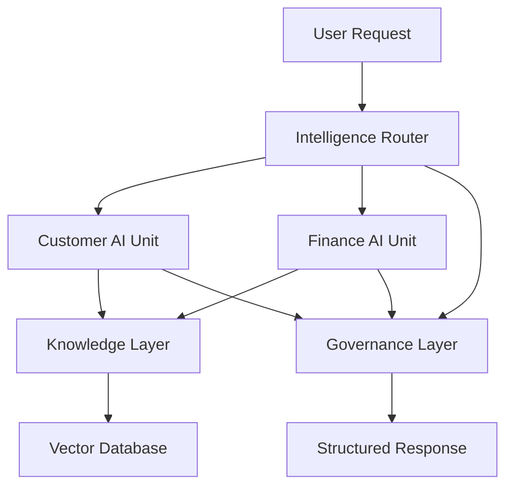

# AION Framework

<p align="center">
  <strong>Enterprise AI Architecture — Not Chatbots.</strong>
</p>

<p align="center">
  AI-Oriented Organization Network
</p>

<p align="center">
  
  
  
  
</p>

---

# Overview

AION is an open source framework for building AI-first enterprise architectures using modular domain units, routing orchestration, RAG-based knowledge systems, and governance enforcement.

It provides structure, contracts, and policy standards for deploying AI across organizations.

---

# Key Features

* Domain-based AI Units
* Router-based orchestration
* RAG with mandatory citations
* Governance and traceability
* Pluggable architecture
* Docker-first deployment

---

# Architecture

See full technical documentation in [`docs/architecture.md`](docs/architecture.md).



---

# Quickstart

```bash
cd infra

docker compose up --build
```

Check:

```bash
curl http://localhost:8000/health
```

---

# Roadmap

## v0.1

* Router
* 2 AI Units
* RAG with citations
* Governance logs

## v0.2

* Policy engine
* Executive AI layer
* Evaluation framework
* Multi-tenant support

## v1.0

* CLI
* Unit scaffolding
* Observability dashboard
* Enterprise governance

---

# Contributing

See [`CONTRIBUTING.md`](CONTRIBUTING.md).

---

# License

MIT License — see [`LICENSE`](LICENSE).

---

# Philosophy

AI is not a feature.

It is infrastructure.
